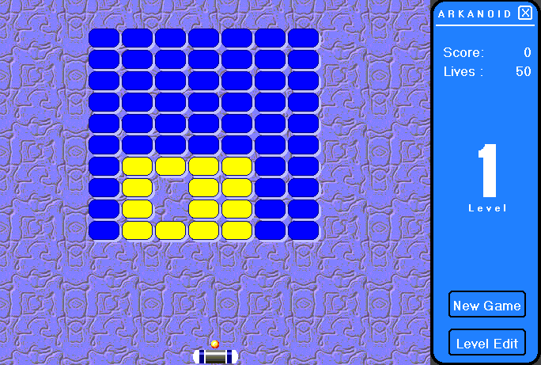

<div align="center">

## Arkanoid


</div>

### Description

This is my version of the old Arkanoid game( If you don't know it see the sreenshot). The game include difrent type of enemies, bonuses and a level editor. I create 12 levels and you can modify them or just replace them with new levels. The collision is very good( determine the side of the collision). This code shows how to play wave sound from resource file. Please send me any suggestions to kicheto@goatrance.com and don't forget to vote for me!
 
### More Info
 


<span>             |<span>
---                |---
**Submitted On**   |2001-07-30 18:37:36
**By**             |[Ivan Uzunov](https://github.com/Planet-Source-Code/PSCIndex/blob/master/ByAuthor/ivan-uzunov.md)
**Level**          |Advanced
**User Rating**    |4.8 (53 globes from 11 users)
**Compatibility**  |VB 5\.0, VB 6\.0
**Category**       |[Games](https://github.com/Planet-Source-Code/PSCIndex/blob/master/ByCategory/games__1-38.md)
**World**          |[Visual Basic](https://github.com/Planet-Source-Code/PSCIndex/blob/master/ByWorld/visual-basic.md)
**Archive File**   |[Arkanoid23940822001\.zip](https://github.com/Planet-Source-Code/ivan-uzunov-arkanoid__1-25767/archive/master.zip)

### API Declarations

```
Public Declare Function BitBlt Lib "gdi32" (ByVal hDestDC As Long, ByVal X As Long, ByVal Y As Long, ByVal nWidth As Long, ByVal nHeight As Long, ByVal hSrcDC As Long, ByVal xSrc As Long, ByVal ySrc As Long, ByVal dwRop As Long) As Long
Public Declare Function sndPlaySound Lib "winmm.dll" Alias "sndPlaySoundA" (ByVal lpszSoundName As String, ByVal uFlags As Long) As Long
```


